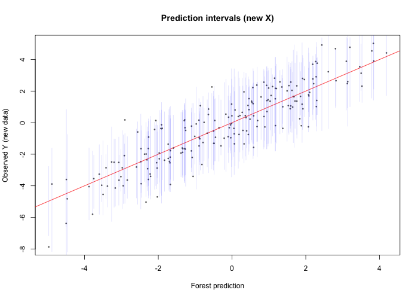
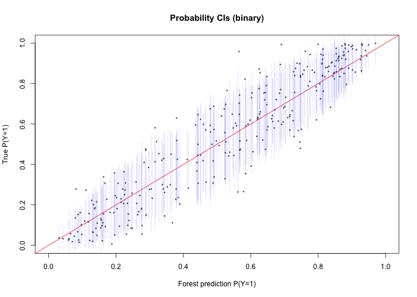
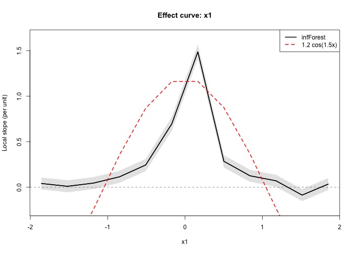
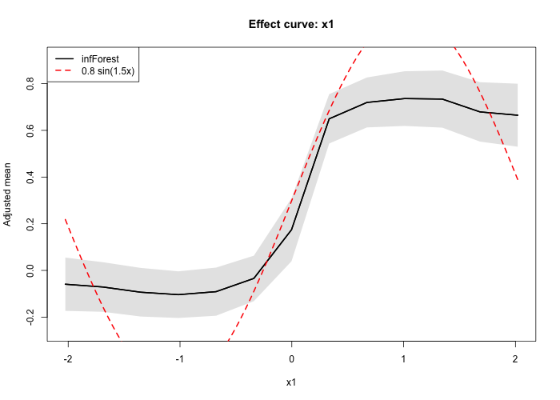
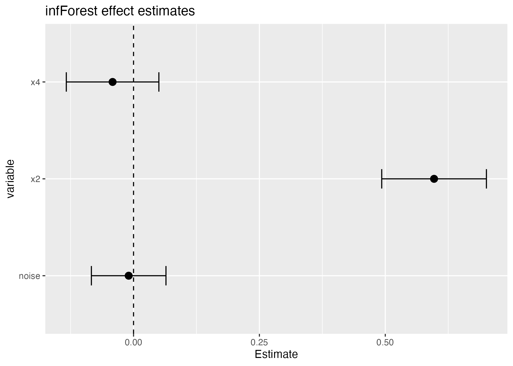

# infForest

> Nonparametric inference from random forests — effects, predictions, and uncertainty quantification

**infForest** is an R package that implements the Inference Forest framework for statistical inference. It provides effect estimates for any predictor (continuous, binary, or categorical), nonlinear effect curves, interaction detection, prediction intervals, confidence intervals for predicted probabilities, and variance decomposition diagnostics — all without functional form assumptions.

## What is this framework?

This is a complement to regression, not a replacement. Regression answers the question: *what do these data say about parameter estimates given my imposed assumptions about the functional form?* Inference forests answer the question: *what do the data themselves say about the effects without any imposed restrictions?*

As the saying goes, "All models are wrong, but some models are useful". When both agree, the parametric assumptions are consistent with the data. When they disagree, that serves as evidence that the finite sample doesn't match the imposed structure of the regression model. Both answers are useful. This doesn't mean the parametric assumptions are *necessarily* wrong, it means the data themselves do not strictly match what the parametric, additive, and linear assumptions of regression impose. This could be due to noise, this could be due a mismatch in assumptions and reality, or some mix of the two. 

**Nonparametric.** No linearity, no additivity, no link functions. The forest discovers the functional form from the data. For binary outcomes, predicted probabilities live on [0, 1] naturally — no logit link, no linearity on the log-odds scale.

**Asymptotically unbiased.** As sample size grows, the estimates converge to the true effects. In finite samples, the estimates are provably conservative — they underestimate effects on average. This conservative bias decreases with sample size and with model simplicity (fewer predictors, less complexity). If you see an effect, it exists in the finite sample. 

**Confounding adjustment.** Effects are adjusted for all other variables in the model. The propensity model within the doubly robust agumented inverse probabilitiy weighting (AIPW) framework (propensity estimated by ridge regression) corrects for confounding, analogous to including covariates in a regression model. The correction is doubly robust: the estimate is consistent if either the forest predictions or the propensity model is correctly specified.

**No p-values by design.** The package focuses on effect sizes and precision. Every estimate comes with a standard error and confidence interval at a user-specified level (default 95%). P-values are available via `p.value = TRUE` but are not shown by default. The deliberate default reflects a focus on practical significance over null hypothesis testing.

### Conservative bias and model complexity

The finite-sample conservative bias (attenuation toward zero) arises from the forest's nonparametric smoothing. Two factors control its magnitude:

- **Sample size.** More data → more leaves across a forest → less smoothing → less attenuation.
- **Model complexity.** More predictors spread the forest's splitting budget, increasing effective smoothing per variable. Reducing irrelevant predictors concentrates the forest on important dimensions and reduces attenuation.

Variable selection is built into the framework via the standardized splitting criterion stored during tree fitting. The `eimp()` function computes the average penalized impurity reduction for each variable across all nodes where it was a candidate. Variables above the noise floor (positive Δ̄_j) are signal; variables at or below zero are indistinguishable from noise and can be safely removed.

### Effect importance

`eimp()` returns the standardized criterion importance Δ̄_j — the average excess impurity reduction beyond the EVT-corrected noise floor, across all nodes where the variable was a splitting candidate. This is the nonparametric analogue of a partial F-statistic in regression. At each node, the forest evaluates every candidate variable's best split, subtracts the expected criterion under the null (scaled by the number of candidate cutpoints), and records the result — positive for variables that beat the noise floor, negative for those that don't. The average across all nodes gives Δ̄_j.

```r
fit <- infForest(y ~ ., data = dat, num.trees = 5000, penalize = TRUE, softmax = TRUE)
eimp(fit)
#> Effect Importance (50000 trees)
#> Main effects:
#>   x2     delta_bar =   4.8730  pi = 0.85  *
#>   x1     delta_bar =   4.7874  pi = 1.00  *
#>   group  delta_bar =   2.5277  pi = 0.80  *
#>   trt    delta_bar =   1.8118  pi = 0.76  *
#>   x4     delta_bar =  -4.0217  pi = 0.26
#>   noise  delta_bar =  -6.6312  pi = 0.01
#>
#>   * = above noise floor (delta_bar > 0)
#>   4 signal, 2 noise. Refit without: x4, noise
```

The `pi` column is the split frequency — the fraction of trees that split on each variable. Variables with Δ̄_j ≤ 0 can be removed and the model refitted. The AIPW inference in the refitted model preserves type I error because the sandwich variance recalibrates to the new estimator's variance — screening on Δ̄_j and refitting is a valid two-stage procedure.

`split_frequency()` returns the split inclusion rates directly:

```r
split_frequency(fit)
#> Split Frequency (50000 total trees)
#>  variable n_trees   pct
#>        x1   50000 100.0
#>        x2   42325  84.7
#>     group   40165  80.3
#>       trt   38226  76.5
#>        x4   13092  26.2
#>     noise     451   0.9
```

For interactions, `eimp()` computes the attenuation factor λ — the fraction of interaction signal preserved when both variables don't always appear in the same tree. The variance inflation factor VIF = 1/λ² quantifies the efficiency loss:

```r
eimp(fit, interactions = c("x2:trt", "noise:trt"))
```


## Installation

```r
# Requires the inf.ranger fork of ranger
devtools::install_github("NateOConnellPhD/inf.ranger")
devtools::install_github("NateOConnellPhD/infForest")
```

### About inf.ranger

infForest uses [ranger](https://github.com/imbs-hl/ranger) as its forest engine. The `inf.ranger` package is a minimal fork of ranger with two targeted modifications to the split selection code — the tree-growing algorithm, prediction machinery, and all other ranger internals are unchanged.

**`penalize.split.competition`** — At each node, standard CART selects the variable with the largest impurity reduction. But continuous variables have an inherent advantage in that they evaluate many more candidate split points than binary variables. It's effectively a multiple comparison problem within split selection. This gives them a structural advantage over binary variables, even when the true signal is equal. Further, continuous variables have the advantage of giving their split perfect balance (e.g. splitting at the median), exacerbating their advantage. The standardized criterion subtracts the expected search advantage from each variable's best split score, producing a level comparison across variable types. The correction is closed-form and adds negligible computation. When enabled, the penalized criterion values are stored for each variable across all nodes and trees, enabling the `eimp()` diagnostic in infForest.

**`softmax.split`** — Standard CART selects the single best variable at each node (argmax). Softmax replaces this with probabilistic selection: variables are chosen with probability proportional to their penalized criterion scores. This increases the inclusion rate for variables with moderate but real signal. 

Both modifications operate only at the moment of variable selection within each node. Everything downstream — split point selection, daughter node assignment, leaf predictions, prediction — is identical to standard ranger.


### Computational speed and Parallelism

infForest has two independent parallelism layers. Both are optional, but recommended for optimal performance. We've designed this packaged with computational speed and efficiency in mind. Back-end processing is optimized in C++ wherever possible, while necessary fitted forest information is cached in the working memory for immediate access for effect and variance estimation. 

**R-level (future/future.apply):** PASR fitting distributes independent paired-forest replicates across worker processes. Set up once at the top of your script:

```r
library(future)
library(future.apply)
plan(multisession, workers = 8)
options(future.globals.maxSize = 2 * 1024^3)  # needed for large ranger objects
```

**C++ backend (OpenMP):** PASR extraction scores cached forests using OpenMP threads within a single process:

```r
options(infForest.threads = 8)
```

On macOS, OpenMP requires `libomp` (`brew install libomp`) and the appropriate flags in `~/.R/Makevars`. On Linux with GCC, OpenMP works out of the box.


## Part 1: Pointwise Predictions and Prediction Intervals

Pointwise predictions with variance estimates and prediction intervals are a standalone contribution of the PASR (Procedure-Aligned Synthetic Resampling) framework. PASR provides finite sample variance estimation along with pointwise prediction and confidence intervals for Random Forest fitted models.

`pasr_predict()` takes a fitted `ranger` model and the training data, fits once, and then predicts at any new points via `predict()`. We will be adding support for additional RF based packages. For pure prediction, fitting ranger on the full dataset is recommended — no data halving from honest splitting through infForest is needed.

For continuous outcomes, two types of intervals are returned:

- **Confidence interval** (`ci_lower`, `ci_upper`): covers the conditional mean E[Y | X = x] — where the true regression surface is at this covariate value.
- **Prediction interval** (`pi_lower`, `pi_upper`): covers a new observation Y_new | X = x. Always wider than the CI because it adds the irreducible outcome variability Var(Y | X = x).

For binary outcomes, only confidence intervals are provided. These cover the true probability P(Y = 1 | X = x).

### Prediction intervals (continuous)

```r
library(inf.ranger)
library(infForest)

set.seed(42)
n <- 1000
x1 <- rnorm(n); x2 <- rnorm(n); x3 <- rnorm(n)
y <- 2 * x1 + sin(x2) + rnorm(n)
dat <- data.frame(x1, x2, x3, y)

# Fit ranger on full training data
rf <- ranger(y ~ ., data = dat, num.trees = 5000, keep.inbag = TRUE)

# Fit PASR once — stores everything needed for prediction
ps <- pasr_predict(rf, data = dat, x_conditional = FALSE, R = 80, verbose = TRUE)

# Predict at new points (instant — reuses stored forests)
dat_new <- data.frame(x1 = rnorm(200), x2 = rnorm(200), x3 = rnorm(200))
pi <- predict(ps, newdata = dat_new)
head(pi[, c("f_hat", "se", "ci_lower", "ci_upper", "pi_lower", "pi_upper")])
```



### Confidence intervals for predicted probabilities (binary)

For binary outcomes, predicted probabilities live on [0, 1] naturally. No logit link, no back-transformation -- the probabilities are estimated on their natural scale. 

```r
rf_bin <- ranger(y ~ ., data = dat_bin, num.trees = 5000, probability = TRUE)
ps_bin <- pasr_predict(rf_bin, data = dat_bin, R = 80, verbose = TRUE)
pi_bin <- predict(ps_bin, newdata = dat_bin_new)
head(pi_bin[, c("f_hat", "se", "ci_lower", "ci_upper")])
```



### Covariance floor diagnostic

`ct_diagnose()` decomposes the forest variance into Monte Carlo variance (V/B, goes to zero with more trees) and the covariance floor (C_T, irreducible structural dependence). Pass the already-fitted PASR object — no refitting.

```r
ct <- ct_diagnose(ps, data = dat)
ct
plot(ct)
plot(ct, by = "x1")
```


## Part 2: Effect Estimation and Inference

The core workflow: fit an `infForest`, run `pasr()` once to cache paired forests, then call `effect()`, `summary()`, `int()`, `effect_curve()`, `predict()`, or `forest_means()` — all extract from cached results.

```r
fit <- infForest(y ~ ., data = dat, num.trees = 5000, penalize = TRUE, softmax = TRUE)
pasr(fit, R = 100)                # one-time cost — caches paired forests
effect(fit, "trt")                # instant extraction
```

### Variance estimation

Two variance estimators are available for all effect estimates, controlled by the `variance` argument:

**PASR variance** (`variance = "pasr"`, default) estimates the unconditional variance of the effect — the variability you would see if you could repeatedly draw both new covariates X and new outcomes Y from the population and re-run the entire procedure. This is the variance relevant when generalizing to new data from the same population.

**Sandwich variance** (`variance = "sandwich"`) estimates the conditional variance given the observed covariates X — the variability from only redrawing Y while holding X fixed. This is analogous to the standard variance reported by `lm()` and most regression procedures.

The difference between them is typically small (PASR/sandwich ≈ 0.97 in examples below), but the unconditional PASR variance is the technically correct target for inference about population-level effects. PASR is the default because the paired forests are already cached after calling `pasr()`, so both estimators are equally fast to compute. Use `variance = "both"` to see both side by side.

### Binary effects

For binary predictors, `effect()` estimates the average difference in the outcome between the two levels: E[f(X, trt=1)] - E[f(X, trt=0)]. This is an AIPW-debiased contrast — the propensity model adjusts for confounding by other variables, analogous to covariate adjustment in regression.

The estimate is the marginal effect: the expected change in the outcome if the entire population were switched from trt=0 to trt=1, holding everything else at its observed value. The `marginals = TRUE` option additionally returns the adjusted mean at each level.

```r
effect(fit, "trt")
#>   1 vs 0:      0.2518
#>   SE (PASR):   0.0614  |  95% CI: [0.1315, 0.3722]

effect(fit, "trt", p.value = TRUE)
#>   p-value:     4.10e-05

# Adjusted means: population-average prediction at each treatment level
effect(fit, "trt", marginals = TRUE)
#>   trt = 1:  0.3481  SE = 0.0585  95% CI [0.2334, 0.4628]
#>   trt = 0:  0.0963  SE = 0.0515  95% CI [-0.0046, 0.1972]

# Compare variance estimators
effect(fit, "trt", variance = "both")
#>   SE (sandwich): 0.0606  |  95% CI: [0.1332, 0.3705]
#>   SE (PASR):     0.0614  |  95% CI: [0.1315, 0.3722]
#>   rho_V:         0.97
```

### Continuous effects

For continuous predictors, `effect()` estimates the per-unit change between two anchor points. By default, these are the 25th and 75th percentiles. The estimate is the integrated slope of the forest's learned curve between those points, divided by the distance — a nonparametric average derivative over that range.

The `at` argument controls the anchor points. Values between 0 and 1 are interpreted as quantiles; `type = "value"` uses raw covariate values instead. Multiple anchors produce all pairwise contrasts.

The `bw` parameter controls the number of observations per grid interval used to construct the slope estimate. Larger values give coarser but more stable estimates.

```r
effect(fit, "x2")                                     # Q75 vs Q25 (default)
effect(fit, "x2", at = c(0.10, 0.50, 0.90))          # custom quantile anchors
effect(fit, "x2", at = c(-1, 0, 1), type = "value")  # raw value anchors

# Null variable correctly detected
effect(fit, "noise", p.value = TRUE)
#>   Q75 - Q25: -0.0097   SE (PASR): 0.0307   p-value: 0.7527
```

### Categorical effects

For categorical predictors, `effect()` computes all pairwise contrasts. Each pair is treated as a binary comparison restricted to observations at those two levels, with a pair-specific propensity model. The `at` argument selects specific levels to compare.

```r
effect(fit, "group", p.value = TRUE)
#>   B - A:  0.4019   SE (PASR): 0.0653   p: 7.57e-10
#>   C - A:  0.5076   SE (PASR): 0.0975   p: 1.93e-07
#>   C - B:  0.0992   SE (PASR): 0.0625   p: 0.3091

effect(fit, "group", at = c("A", "C"))                # specific contrast
```

### Effect curves

`effect_curve()` traces the full nonparametric relationship between a continuous predictor and the outcome. Two types are available:

The **slope curve** (`type = "slope"`) estimates the local derivative df/dx at a grid of points across the predictor's range. This shows how the outcome changes per unit change in the predictor at each location — revealing nonlinearity, plateaus, and threshold effects. This curve may seem abstract at first. The effect plotted on yht Y-axis is not the outcome of the model, it is the estimated *slope* of X on Y across the support of X. A horizontal line represents a constant slope between X and Y over that region of X; An increasing slope represents a non-linear increasing slope; A decreasing slope estimate represents a non-linear decreasing slope. 

The **level curve** (`type = "level"`, default) integrates the slope curve to reconstruct f(x) up to an additive constant. This shows the shape of the forest's learned partial effect, directly comparable to a regression curve. That is, this shows the estimated relationship between X and Y, adjusted for by the model. 

The `q_lo` and `q_hi` arguments trim the grid to avoid extrapolation in sparse tails.

```r
ec <- effect_curve(fit, "x1", q_lo = 0.02, q_hi = 0.98)
plot(ec)

ec_level <- effect_curve(fit, "x1", q_lo = 0.02, q_hi = 0.98, type = "level")
plot(ec_level)
```





### Interactions

`int()` estimates how the effect of one variable changes across levels of another. For each level of the `by` variable, it computes the effect of the primary variable within that subgroup, then tests whether the subgroup effects differ. This is analogous to an interaction term in regression, but without assuming the interaction is multiplicative or linear.

The subgroup effects use the same estimation machinery as `effect()` — that is, contrasts within each stratum. The difference between subgroup effects is a contrast of contrasts, with its own SE and CI.

```r
int(fit, "x2", by = "trt", p.value = TRUE)
#>   trt = 1:  0.6768 (per unit)  SE: 0.0707
#>   trt = 0:  0.4431 (per unit)  SE: 0.0627
#>   Diff:     0.2337             SE: 0.0945   p: 0.0134
```

### Summary

`summary()` estimates multiple effects in a single call using formula notation. This is the primary interface for reporting — one line produces a complete table of adjusted effect estimates. Bracket notation controls comparison points:

- `x2[.10, .90]` — per-unit slope from Q10 to Q90
- `group["A", "C"]` — specific categorical contrast
- `x1*x2` — main effects plus interaction
- `x1:x2` — interaction only

```r
summary(fit, ~ trt + x2[.10, .90] + noise + group["A", "C"], p.value = TRUE)
#>   x2     Q90 - Q10   0.4723  (per unit)  (SE: 0.0939)  p: 4.91e-07
#>   noise  Q75 - Q25  -0.0097  (per unit)  (SE: 0.0378)  p: 0.7980
#>   group  C - A       0.5076  (per unit)  (SE: 0.0777)  p: 6.52e-11
#>   trt    binary      0.2518  (SE: 0.0606)              p: 3.20e-05
```

### Adjusted means

`forest_means()` computes marginalized predictions at specified covariate values, averaging over the empirical distribution of all other variables. This answers "what would the population-average outcome be if everyone had x = value?" — the nonparametric analogue of EMMs/least-squares means from parametric models. Multiple variables can be fixed simultaneously for joint marginalization.

```r
forest_means(fit, trt = c(0, 1))
#>   trt = 0  0.0963  SE = 0.0425  95% CI [0.0130, 0.1795]
#>   trt = 1  0.3481  SE = 0.0498  95% CI [0.2505, 0.4457]

forest_means(fit, trt = c(0, 1), x2 = 0)              # joint marginalization
```

### Marginalized predictions

`predict()` on an infForest object automatically detects whether `newdata` contains all predictors or a subset. When all predictors are provided, it returns pointwise predictions with confidence and prediction intervals. When only a subset is provided, it marginalizes over the missing variables by averaging predictions across the empirical distribution of the unspecified covariates — each query point is replicated n times with the training values of the missing variables filled in.

```r
# Pointwise: all covariates → prediction + PI
predict(fit, newdata = dat[1:5, ])

# Marginalized: only trt specified → averages over everything else
predict(fit, newdata = data.frame(trt = c(0, 1)))
#>  trt estimate      se ci_lower ci_upper
#>    0  0.09626 0.04246  0.01304   0.1795
#>    1  0.34810 0.04981  0.25046   0.4457

# Multiple fixed variables
predict(fit, newdata = data.frame(trt = 1, x2 = c(-1, 0, 1)))
#>  trt x2 estimate      se ci_lower ci_upper
#>    1 -1   0.1554 0.06499  0.02801   0.2828
#>    1  0   0.5976 0.07993  0.44097   0.7543
#>    1  1   0.8704 0.07961  0.71440   1.0265
```

### Effect transformations (binary outcomes)

For binary outcomes, `transform_effect()` converts the risk difference to standard epidemiological measures using the delta method.

```r
e <- effect(fit_bin, "trt", marginals = TRUE)
transform_effect(e, "OR")    # Odds ratio:       1.52  95% CI [1.08, 2.13]
transform_effect(e, "RR")    # Risk ratio:        1.20  95% CI [1.04, 1.39]
transform_effect(e, "RD")    # Risk difference:   0.10  95% CI [0.02, 0.18]
transform_effect(e, "NNT")   # NNT:               9.76  95% CI [1.94, 17.58]
```

### The $df interface

Every result object has a `$df` data frame for programmatic access. This integrates directly with ggplot2:

```r
library(ggplot2)
s <- summary(fit, ~ trt + x2 + noise + x4, p.value = TRUE)
ggplot(s$df, aes(x = variable, y = estimate)) +
  geom_point(size = 3) +
  geom_errorbar(aes(ymin = ci_lower, ymax = ci_upper), width = 0.2) +
  geom_hline(yintercept = 0, lty = 2) +
  coord_flip()
```




## Design parameters

| Parameter | Default | Purpose |
|-----------|---------|---------|
| `num.trees` | 5000 | More trees → lower MC variance. 5000 recommended for inference. |
| `honesty.splits` | 5 | Independent fold assignments averaged. At large n (>2000), 2-3 is sufficient. |
| `penalize` | TRUE | Corrects variable selection bias. Always use for inference. |
| `softmax` | TRUE | Proportional variable selection. Ensures all variables with signal receive positive split probability. |
| `min.node.size` | 10 | Controls resolution. Smaller → finer conditioning, more variance per leaf. |
| `replace` | FALSE | Sampling without replacement maximizes effective sample size per fold. |
| `bw` | 20 | Grid bandwidth for continuous effects. Larger → faster, coarser. |
| `alpha` | 0.05 | Confidence level for intervals (1 - alpha). |
| `p.value` | FALSE | Include p-values in output. Two-sided Wald test, H₀: effect = 0. |
| `variance` | "pasr" | Variance estimator: "pasr" (unconditional, default), "sandwich", or "both". |


## How it works

### Honest estimation
Data is split into build and estimation folds. Trees are grown on the build fold; all effect estimates use only estimation-fold outcomes. This eliminates adaptive bias. Multiple independent splits are averaged to reduce fold-assignment variance.

### AIPW debiasing
Forest prediction contrasts are biased because trees that split on a variable absorb its signal into the tree structure. The AIPW correction adds propensity-weighted honest residuals, making the bias the *product* of the prediction error and the propensity error — small even when both models are moderately wrong.

### Standardized splitting and softmax selection
Implemented in `inf.ranger`. The standardized criterion corrects variable selection bias from the search advantage; softmax selection ensures moderate signals get represented in the tree structure.

### PASR variance estimation
The covariance floor captures irreducible dependence between trees sharing training data. PASR estimates it by generating synthetic outcomes from a fitted nuisance model, refitting paired forests on each synthetic dataset with shared fold assignments, and computing the cross-covariance. PASR is the default variance estimator — it provides unconditional variance (over both Y and X randomness), while sandwich variance is conditional on the training X.

### Variable selection via effect importance
During tree fitting with `penalize.split.competition = TRUE`, each candidate variable's best split is evaluated against an EVT-corrected noise floor. The penalized criterion Δ̃_j = G_j - τ² · 2·log(2·M_j) subtracts the expected maximum of M_j null criterion values, where M_j is the number of candidate cutpoints for variable j. This is accumulated across all nodes and trees. The average Δ̄_j separates signal variables (positive) from noise (zero or negative). Removing noise variables and refitting concentrates the forest's splitting budget on signal dimensions, reducing finite-sample attenuation.


## Scope and limitations

- **No time series or clustered data.** The framework assumes independent observations. Extensions are future work.


## References

O'Connell, N.S. (2026). Random Forests as Statistical Procedures: Design, Variance, and Dependence. *arXiv:2602.13104*. [[paper]](https://arxiv.org/abs/2602.13104)

O'Connell, N.S. (2026). Inference Forests: A General Framework for Nonparametric Inference. *In preparation*.

## Citation

```bibtex
@article{oconnell2026rf,
  title={Random Forests as Statistical Procedures: Design, Variance, and Dependence},
  author={O'Connell, Nathaniel S.},
  journal={arXiv preprint arXiv:2602.13104},
  year={2026}
}

@article{oconnell2026infforest,
  title={Inference Forests: A General Framework for Nonparametric Inference},
  author={O'Connell, Nathaniel S.},
  journal={in preparation},
  year={2026}
}

@article{oconnell2026varStability,
  title={Variance stability and screening validity for Inference Forests},
  author={O'Connell, Nathaniel S.},
  journal={in preparation},
  year={2026}
}
```
