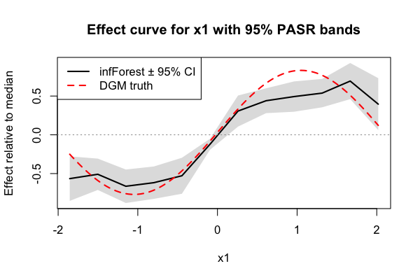
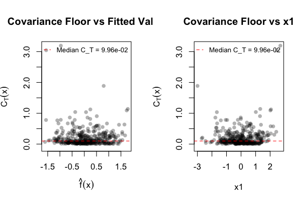
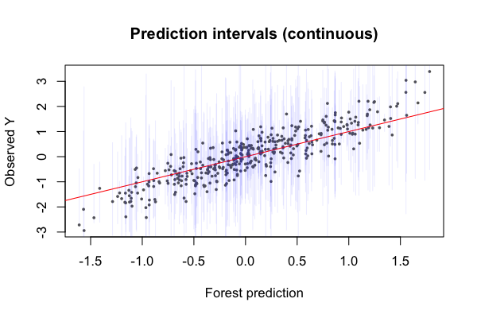
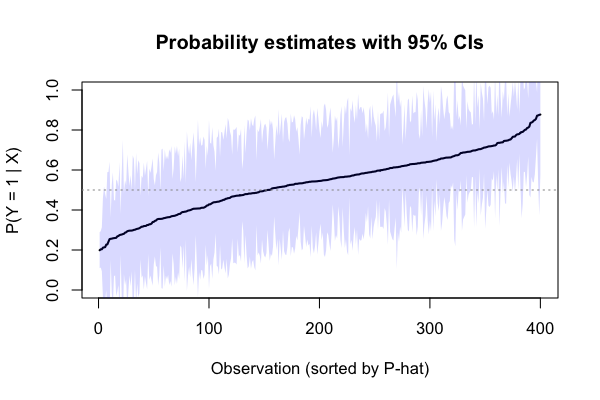

# infForest

> Nonparametric inference from random forests — effects, predictions, and uncertainty quantification

**infForest** is an R package that turns random forests into full inferential procedures. It provides effect estimates for any predictor, nonlinear effect curves, interaction detection, prediction intervals, confidence intervals for predicted probabilities, and variance decomposition diagnostics — all without functional form assumptions.

## Installation

```r
# Requires the inf.ranger fork of ranger
devtools::install_github("NateOConnellPhD/inf.ranger")
devtools::install_github("NateOConnellPhD/infForest")
```

### About inf.ranger

infForest uses [ranger](https://github.com/imbs-hl/ranger) as its forest engine. The `inf.ranger` package is a minimal fork of ranger with two targeted modifications to the split selection code — the tree-growing algorithm, prediction machinery, and all other ranger internals are unchanged.

**`penalize.split.competition`** — At each node, CART selects the variable with the largest impurity reduction. But continuous variables evaluate many more candidate split points than binary variables, giving them a structural advantage: the maximum of *M* noisy candidates is systematically larger than the maximum of 1, even under the null. This is the search advantage (a winner's curse proportional to $\sqrt{2 \log M}$). The standardized criterion subtracts the expected search advantage from each variable's best split score, producing a level comparison across variable types. The correction is closed-form and adds negligible computation.

**`softmax.split`** — Standard CART selects the single best variable at each node (argmax). Softmax replaces this with probabilistic selection: variables are chosen with probability proportional to $\exp(\tau \cdot \tilde{G}_j)$, where $\tilde{G}_j$ is the penalized criterion. This increases the inclusion rate for variables with moderate but real signal that would otherwise be crowded out by stronger predictors at every node. The temperature $\tau$ is set automatically. Requires `penalize.split.competition = TRUE`.

Both modifications operate only at the moment of variable selection within each node. Everything downstream — split point selection, daughter node assignment, leaf predictions, OOB estimation, prediction — is identical to standard ranger.

## Worked example

A complete walkthrough with a simple DGM. The runnable script is in [`vignettes/worked_example.R`](vignettes/worked_example.R).

### Data-generating mechanism

Five predictors: a nonlinear continuous effect (sin curve), a linear continuous effect with an interaction, a binary treatment, a correlated confounder, and noise.

```r
library(infForest)
set.seed(42)
n <- 400

x1    <- rnorm(n)                               # nonlinear (sin)
x2    <- rnorm(n)                               # linear + interaction
trt   <- rbinom(n, 1, 0.4)                      # binary treatment
x4    <- 0.5 * x2 + rnorm(n) * sqrt(0.75)      # correlated with x2
noise <- rnorm(n)                               # null

mu <- 0.8 * sin(1.5 * x1) + 0.4 * x2 + 0.3 * trt + 0.2 * x2 * trt
y_cont <- mu + (0.5 + 0.2 * abs(x1)) * rnorm(n)
y_bin  <- factor(rbinom(n, 1, plogis(mu)), levels = c(0, 1))

dat_cont <- data.frame(x1, x2, trt, x4, noise, y = y_cont)
dat_bin  <- data.frame(x1, x2, trt, x4, noise, y = y_bin)
```

True effects: trt = 0.30, x2 marginal slope ≈ 0.48 (includes interaction with trt), x4 = 0 (confounded), noise = 0, x2×trt interaction = 0.20 per unit.

### Fit the forest

```r
fit <- infForest(y ~ ., data = dat_cont, num.trees = 3000,
                 penalize = TRUE, softmax = TRUE)
fit
#> Inference Forest
#>   Outcome type:     continuous
#>   Observations:     400
#>   Predictors:       5
#>   Trees per forest: 3000
#>   mtry:             2
#>   min.node.size:    10
#>   Honest:           yes
#>   Honesty splits:   5
#>   Penalized splits: TRUE
#>   Softmax splits:   TRUE
```

### Effect estimation

```r
# Binary predictor: population-averaged treatment effect
effect(fit, "trt")
#>   Variable:    trt
#>   Type:        binary
#>   Estimate:    0.2862

# Continuous predictor: default is per-unit slope from Q25 to Q75
effect(fit, "x2")
#>   Pairwise contrasts (per unit):
#>     Q25 to Q75  [-0.701, 0.600]:  0.8875

# Specify different quantile comparison points
# Returns all pairwise contrasts
effect(fit, "x2", at = c(0.10, 0.50, 0.90))
#>   Pairwise contrasts (per unit):
#>     Q10 to Q50  [-1.383, -0.068]:  0.8810
#>     Q10 to Q90  [-1.383, 1.182]:   0.8332
#>     Q50 to Q90  [-0.068, 1.182]:   0.7830

# Use raw values instead of quantiles
effect(fit, "x2", at = c(-1, 0, 1), type = "value")
#>   Pairwise contrasts (per unit):
#>     -1 to 0  [-1.000, 0.000]:  0.8299
#>     -1 to 1  [-1.000, 1.000]:  0.7602
#>      0 to 1  [0.000, 1.000]:   0.6905

# Finer grid resolution (fewer intervals in the underlying curve)
effect(fit, "x2", bw = 50)
#>   Pairwise contrasts (per unit):
#>     Q25 to Q75  [-0.701, 0.600]:  0.6830

# Null predictor: should be near zero
effect(fit, "noise")
#>     Q25 to Q75  [-0.669, 0.713]:  0.1507

# Confounder: correlated with x2, no direct effect
effect(fit, "x4")
#>     Q25 to Q75  [-0.765, 0.585]:  -0.0517
```

### PASR confidence interval for an effect

```r
pe_trt <- pasr_effect(fit, "trt", verbose = TRUE)
#>   PASR R=20: C_psi=0.006248  rel_change=Inf  stable=0/2
#>   PASR R=30: C_psi=0.006104  rel_change=0.0231  stable=0/2
#>   PASR R=40: C_psi=0.005976  rel_change=0.0208  stable=1/2
#>   PASR converged at R=40 (C_psi=0.005976)
pe_trt
#>   Estimate:    0.2871
#>   SE:          0.0773
#>   95% CI:      [0.1355, 0.4387]
#>   p-value:     0.000206
```

### Nonlinear effect curve with PASR confidence bands

The effect curve traces $E[Y \mid X_1 = x] - E[Y \mid X_1 = \text{ref}]$ nonparametrically. The true shape is $0.8 \sin(1.5 x_1)$. PASR confidence bands are computed at each grid point by calling `pasr_effect` with raw value contrasts against the median.

```r
ec <- effect_curve(fit, "x1", bw = 20)
x1_ref <- median(x1)
x1_grid <- seq(quantile(x1, 0.10), quantile(x1, 0.90), length.out = 12)

curve_ests <- numeric(length(x1_grid))
curve_ses  <- numeric(length(x1_grid))
for (g in seq_along(x1_grid)) {
  pe <- pasr_effect(fit, "x1", at = c(x1_grid[g], x1_ref), type = "value")
  span <- x1_grid[g] - x1_ref
  curve_ests[g] <- pe$contrasts$estimate[1] * span
  curve_ses[g]  <- pe$se * abs(span)
}

plot(x1_grid, curve_ests, type = "l", lwd = 2,
     xlab = "x1", ylab = "Effect relative to median",
     main = "Effect curve for x1 with 95% PASR bands",
     ylim = range(c(curve_ests - 1.96 * curve_ses,
                    curve_ests + 1.96 * curve_ses)))
polygon(c(x1_grid, rev(x1_grid)),
        c(curve_ests - 1.96 * curve_ses, rev(curve_ests + 1.96 * curve_ses)),
        col = rgb(0, 0, 0, 0.15), border = NA)
curve(0.8 * sin(1.5 * x) - 0.8 * sin(1.5 * x1_ref),
      add = TRUE, col = "red", lty = 2, lwd = 2)
abline(h = 0, col = "gray60", lty = 3)
```



### Interaction estimation

The DGM has an x2 × trt interaction (coefficient 0.20): the slope of x2 is 0.40 when trt = 0 and 0.60 when trt = 1.

```r
int(fit, "x2", by = "trt")
#> Inference Forest Interaction
#>   Variable:   x2
#>   By:         trt (binary)
#>
#>   Subgroup effects:
#>     trt = 1                           0.6062  (per unit)
#>     trt = 0                           0.7645  (per unit)
#>
#>   Pairwise differences:
#>     trt = 1 vs trt = 0               -0.1583
```

### Covariance floor diagnostic

The covariance floor $C_T(x)$ shows where the forest's irreducible prediction uncertainty is highest — typically in regions with sparse data or complex signal.

```r
ct <- ct_diagnose(fit, R = 30L, verbose = TRUE)
#>   PASR R=20: median_Ct=0.101409  med_rel_change=Inf  stable=0/2
#>   PASR R=30: median_Ct=0.099561  med_rel_change=0.1241  stable=0/2
#>   PASR reached R_max=30 without convergence (median Ct=0.099561)
ct
#> Covariance Floor Diagnostic (C_T)
#>   Prediction points: 400
#>
#>   C_T summary:
#>     Mean:   0.204829
#>     Median: 0.099561
#>     SD:     0.305072
#>     Range:  [0.003369, 3.192264]
#>     IQR:    [0.047316, 0.265328]
#>
#>   MC variance (V/B) mean: 0.000043
#>   Ct / total variance:    100.0%

# C_T vs fitted value, C_T vs a covariate
par(mfrow = c(1, 2))
plot(ct)
plot(ct, by = "x1")
par(mfrow = c(1, 1))
```



### Prediction intervals (continuous outcome)

```r
pi_cont <- pasr_predict(fit, R_max = 50L, verbose = TRUE)
#>   PASR R=20: median_Ct=0.106982  med_rel_change=Inf  stable=0/2
#>   PASR R=30: median_Ct=0.105878  med_rel_change=0.1280  stable=0/2
#>   PASR R=40: median_Ct=0.106638  med_rel_change=0.0836  stable=0/2
#>   PASR R=50: median_Ct=0.106465  med_rel_change=0.0748  stable=0/2
#>   PASR reached R_max=50 without convergence (median Ct=0.106465)

head(pi_cont[, c("f_hat", "se", "ci_lower", "ci_upper", "pi_lower", "pi_upper")])
#>      f_hat     se  ci_lower ci_upper  pi_lower  pi_upper
#> 1  1.4204 0.9328  -0.4078   3.2486   -1.3069    4.1477
#> 2 -0.5748 0.5246  -1.6029   0.4534   -2.4663    1.3167
#> 3  0.5977 0.1940   0.2174   0.9780   -0.0359    1.2314
#> 4  0.5863 0.2425   0.1110   1.0615   -0.3207    1.4932
#> 5 -0.4838 0.9664  -2.3780   1.4104   -4.4210    3.4534
#> 6 -0.3674 0.0579  -0.4808  -0.2539   -0.4808   -0.2539

# Plot
plot(pi_cont$f_hat, dat_cont$y, pch = 16, cex = 0.5, col = "gray40",
     xlab = "Forest prediction", ylab = "Observed Y",
     main = "Prediction intervals (continuous)")
abline(0, 1, col = "red")
segments(pi_cont$f_hat, pi_cont$pi_lower, pi_cont$f_hat, pi_cont$pi_upper,
         col = rgb(0, 0, 1, 0.08))
```



### Confidence intervals for probabilities (binary outcome)

```r
fit_bin <- infForest(y ~ ., data = dat_bin, num.trees = 3000,
                     penalize = TRUE, softmax = TRUE)
pi_bin <- pasr_predict(fit_bin, R_max = 50L, verbose = TRUE)
#>   PASR R=20: median_Ct=0.021938  med_rel_change=Inf  stable=0/2
#>   PASR R=30: median_Ct=0.021815  med_rel_change=0.1263  stable=0/2
#>   PASR R=40: median_Ct=0.021891  med_rel_change=0.0739  stable=0/2
#>   PASR R=50: median_Ct=0.022158  med_rel_change=0.0653  stable=0/2
#>   PASR reached R_max=50 without convergence (median Ct=0.022158)

# Sorted probability plot with CI bands
ord <- order(pi_bin$f_hat)
plot(seq_along(ord), pi_bin$f_hat[ord], type = "l", lwd = 2,
     xlab = "Observation (sorted by P-hat)", ylab = "P(Y = 1 | X)",
     ylim = c(0, 1), main = "Probability estimates with 95% CIs")
polygon(c(seq_along(ord), rev(seq_along(ord))),
        c(pi_bin$ci_lower[ord], rev(pi_bin$ci_upper[ord])),
        col = rgb(0, 0, 1, 0.15), border = NA)
abline(h = 0.5, col = "gray60", lty = 3)
```



## What the package provides

infForest implements two complementary frameworks:

### Variance decomposition and prediction intervals (Paper 1)

Every forest prediction has two sources of uncertainty: Monte Carlo error from using finitely many trees, and a **covariance floor** $C_T(x)$ that persists even with infinite trees. The covariance floor arises because independent trees trained on the same data discover similar prediction rules, creating structural dependence that aggregation cannot eliminate.

infForest decomposes total prediction variance into these components and estimates each via **PASR** (Procedure-Aligned Synthetic Resampling). This yields prediction intervals for continuous outcomes with a theoretically guaranteed conservative bias direction, and the first pointwise confidence intervals for predicted conditional probabilities from a deployed classification forest.

### Effect estimation and inference (Paper 2)

infForest estimates the effect of any predictor using **AIPW** (Augmented Inverse-Propensity Weighted) scores with honest cross-fitting. The estimator combines honest forest prediction contrasts with propensity-weighted residuals, achieving double robustness: consistent if either the forest predictions or the propensity model is consistent. Effects are population-averaged by default. Interactions are estimated via conditional subgroup contrasts. Effect curves trace nonlinear relationships without specifying a functional form.

## Full API reference

### Fitting

```r
fit <- infForest(
  y ~ .,
  data = dat,
  num.trees = 3000,       # trees per forest (3000+ recommended)
  mtry = 5,               # candidates per split
  min.node.size = 10,     # terminal node size
  honesty.splits = 5,     # independent A/B partitions to average
  penalize = TRUE,        # standardized splitting criterion
  softmax = TRUE          # proportional variable selection
)
```

### Effects

```r
effect(fit, "x")                                      # binary or continuous
effect(fit, "x", at = c(0.10, 0.50, 0.90))            # multiple quantile contrasts
effect(fit, "x", at = c(30, 50, 70), type = "value")  # raw value contrasts
effect(fit, "x", bw = 50)                              # bandwidth for grid density
effect(fit, "x", subset = which(dat$z > 0))            # conditional on a subgroup
```

### Effect curves

```r
ec <- effect_curve(fit, "x")
ec <- effect_curve(fit, "x", bw = 30, q_lo = 0.05, q_hi = 0.95)
plot(ec)
```

### Interactions

```r
int(fit, "x1", by = "x2")                             # x1 effect within x2 groups
int(fit, "x1", by = "x2", subset = which(dat$x3 == 1)) # three-way
int(fit, "x1", by = "x2",                             # continuous conditioning
    by_at = list(c(0.10, 0.25), c(0.75, 0.90)))
```

### Batch summary

```r
summary(fit, ~ x1 + x2 + x3)                          # main effects
summary(fit, ~ x1 * x2)                                # main + interaction
summary(fit, ~ x1[0.10, 0.50, 0.90] + x2)             # custom comparison points
summary(fit, ~ x1:x2[0.10,0.25,0.75,0.90])            # custom conditioning bands
```

### PASR variance estimation

```r
pasr_predict(fit, verbose = TRUE)                      # pointwise prediction intervals
pasr_predict(fit, newdata = test_data)                 # at new points
pasr_effect(fit, "treatment", verbose = TRUE)          # effect CI
ct_diagnose(fit)                                       # covariance floor diagnostic
```

## Design parameters

| Parameter | Default | Purpose |
|-----------|---------|---------|
| `num.trees` | 5000 | More trees → lower MC variance. 3000+ recommended for inference. |
| `honesty.splits` | 5 | Independent fold assignments averaged. Reduces fold-assignment noise. |
| `penalize` | TRUE | Corrects variable selection bias (search + balance advantages). Always use for inference. |
| `softmax` | FALSE | Proportional variable selection. Set TRUE for weak signals (e.g., rare binary predictors). |
| `min.node.size` | 10 | Controls resolution. Smaller → finer conditioning, more variance per leaf. |
| `replace` | FALSE | Sampling without replacement maximizes effective sample size per fold. |

## How it works

### Honest estimation
Data is split into build and estimation folds. Trees are grown on the build fold; all effect estimates use only estimation-fold outcomes. This eliminates adaptive bias. Multiple independent splits are averaged to reduce fold-assignment variance.

### AIPW debiasing
Forest prediction contrasts are biased because trees that split on $X_j$ absorb its signal into the tree structure. The AIPW correction adds propensity-weighted honest residuals, making the bias the *product* of the prediction error and the propensity error — small even when both models are moderately wrong.

### Standardized splitting and softmax selection
Implemented in `inf.ranger` (see above). The standardized criterion corrects variable selection bias from the search advantage; softmax selection ensures moderate signals get represented in the tree structure. Together they produce forests where effect estimation is not dominated by whichever predictor type happens to have more candidate split points.

### PASR
The covariance floor $C_T(x)$ captures irreducible dependence between trees sharing training data. PASR estimates it by generating synthetic outcomes from a fitted nuisance model, refitting paired forests on each synthetic dataset with shared fold assignments, and computing the cross-covariance. For effect functionals, scalar-first PASR operates on the effect estimate directly rather than at every prediction point.

## Theoretical foundation

O'Connell, N.S. (2026). Random Forests as Statistical Procedures: Design, Variance, and Dependence. *arXiv:2602.13104*. [[paper]](https://arxiv.org/abs/2602.13104)

O'Connell, N.S. (2026). Inference Forests: A Framework for Nonparametric Inference. *In preparation*.

## Citation

```bibtex
@article{oconnell2026rf,
  title={Random Forests as Statistical Procedures: Design, Variance, and Dependence},
  author={O'Connell, Nathaniel S.},
  journal={arXiv preprint arXiv:2602.13104},
  year={2025}
}

@article{oconnell2026infforest,
  title={Inference Forests: A Framework for Nonparametric Inference},
  author={O'Connell, Nathaniel S.},
  year={2025}
}
```
